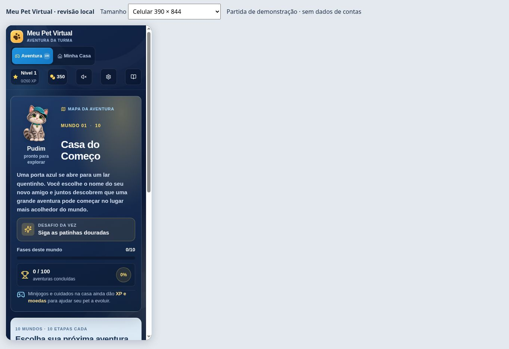

# Meu Pet Virtual — Web Agência AD

Ramo de retomada e revisão móvel de 09/10/2026, preparado para colaboração com o Manus.

**Comece por [Retomada e instruções para o Manus](recovery/RETOMADA-MANUS.md).**

O projeto reúne o código React/TypeScript recuperado, as 158 mídias da publicação e uma cópia íntegra da distribuição v7. A fonte recuperada é anterior à v7; as diferenças de ícones e painel de conta estão documentadas e ainda precisam ser conciliadas.

- `pnpm dev`: cliente de desenvolvimento.
- `/qa-review.html`: demonstração local da aventura, sem contas nem partidas reais.
- `pnpm check`: verificação TypeScript.
- `pnpm build`: build do código editável, ainda sujeito à conciliação.
- `pnpm build:recovery`: gera `out/` preservando a v7 e aplicando somente as correções móveis desta revisão.
- `pnpm dev:server`: fluxo anterior com Express.

Não houve nova publicação online nesta etapa. Os 100 estágios ainda precisam de testes reais na conta de teste.

